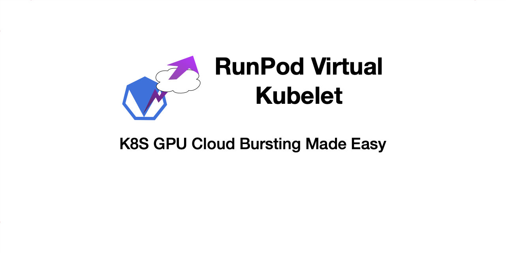

# Kubernetes RunPod Controller
This controller implements cloud bursting for GPU workloads, automatically offloading annotated Kubernetes Jobs to RunPod when cluster resources are constrained or when explicitly requested. It maintains proper Kubernetes representations of RunPod instances and handles their complete lifecycle management.

## Overview

The controller enables cost-efficient hybrid scaling between your local GPU resources and RunPod's GPU cloud. Since on-premises hardware costs are fixed regardless of utilization, the controller prioritizes using your local resources before bursting to usage-billed cloud GPUs, optimizing for both performance and cost.

### How It Works
Install the controller, add your runpod token and annotate your jobs to offload dynamically.

1. **Resource Annotation**: Jobs that can be burst to RunPod must be annotated with `runpod.io/managed: "true"`.

2. **Automatic Bursting**: The controller will automatically offload jobs to RunPod when either:
   - Jobs have been pending for more than [configurable seconds](#configuration) (default 0)
   - The number of pending jobs exceeds a [configurable threshold](#configuration) (default 1)

3. **Explicit Bursting**: You can force immediate offloading by setting the annotation `runpod.io/offload: "true"` on any managed Job.

This approach ensures you maximize the value of your fixed-cost on-premises GPU infrastructure while seamlessly expanding to pay-per-use cloud resources only when necessary, providing the best balance between cost efficiency and computational capacity.

## Key Features

- **Virtual Pod Representation**: Creates Kubernetes Pod objects to represent RunPod instances
- **Lifecycle Management**: Automatically terminates RunPod instances when corresponding Jobs are deleted
- **Resource Optimization**: Selects cost-effective GPUs from RunPod based on memory requirements
- **Seamless Integration**: Jobs offloaded to RunPod appear as running Jobs in Kubernetes
- **Health Monitoring**: Provides HTTP health and readiness endpoints

## Installation

### Prerequisites

- Kubernetes cluster with enough permission to create resources
- RunPod API key
- Go 1.19+

### Building

```bash
go build -o runpod-controller ./cmd/runpod_controller
```

### Virtual Node Setup

First, create the virtual node that will host RunPod instances:

```bash
kubectl apply -f deploy/virtual-node-setup.yaml
```

This creates a non-schedulable virtual node that serves as a placeholder for RunPod instances.

### Deploying to Kubernetes

Create a secret with your RunPod API key:

```bash
kubectl create secret generic runpod-controller-secrets -n kube-system \
  --from-literal=RUNPOD_KEY=your_runpod_api_key
```

Deploy using the provided manifest:

```bash
kubectl apply -f deploy/runpod-controller.yaml
```

## Configuration

The controller can be configured with the following flags:

- `--kubeconfig`: Path to kubeconfig file (only for running outside the cluster)
- `--reconcile-interval`: How often to check for jobs (in seconds, default: 30)
- `--pending-job-threshold`: Number of pending jobs that triggers automatic offloading (default: 1)
- `--max-pending-time`: Maximum time that a job is allowed to stay in pending state before it is offloaded (default: 0)
- `--max-gpu-price`: Maximum price per hour for GPU instances (default: 0.5)
- `--health-server-address`: Address for the health check server (default: :8080)

## Job Annotations

By trial and error I found using a template is the only way to make the API use the preconfigured authentication credentials for custom container registries.
I also found that `COMMUNITY` GPU types are never available via the api.

To use the controller, annotate your GPU Jobs with these annotations:

- `runpod.io/managed: "true"`: Indicates that this job can be managed by the controller
- `runpod.io/required-gpu-memory: "16"`: Specify minimum GPU memory required (in GB)
- `runpod.io/templateId`: specify a template at runpod and use this id.

Optional:
- `runpod.io/offload: "true"`: Explicitly request offloading to RunPod
- `runpod.io/cloud-type`: Specify cloud type, either "SECURE" or "COMMUNITY" (default is "SECURE")
- `runpod.io/container-registry-auth-id`: Specify container registry authentication ID


Example:

```yaml
apiVersion: batch/v1
kind: Job
metadata:
  name: my-gpu-job
  annotations:
    runpod.io/managed: "true"
    runpod.io/offload: "true"
    runpod.io/required-gpu-memory: "16"
    runpod.io/templateId: "yourid"
spec:
  template:
    spec:
      containers:
      - name: my-container
        image: my-gpu-image:latest
        resources:
          requests:
            nvidia.com/gpu: 1
          limits:
            nvidia.com/gpu: 1
      restartPolicy: Never
```

## How It Works

1. **Job Detection**: The controller regularly scans for Jobs with GPU resource requests
2. **Offloading Decision**: When a Job meets the criteria for offloading, it proceeds with the RunPod deployment
3. **RunPod Deployment**:
   - Extracts environment variables and container specs
   - Finds suitable GPU types on RunPod within price constraints
   - Creates a deployment on RunPod
4. **Kubernetes Integration**:
   - Creates a virtual Pod representation linked to the Job
   - Sets the Pod as "Running" on the virtual node
   - Updates the original Job with annotations tracking the RunPod deployment
5. **Cleanup**:
   - Monitors for deleted Jobs
   - Terminates the corresponding RunPod instances when their Jobs are deleted
   - Cleans up virtual Pod representations

## Monitoring

The controller logs all actions and errors. To check logs:

```bash
kubectl logs -f deployment/runpod-controller
```

Health and readiness endpoints are available:

```bash
# Check liveness
curl http://<controller-service-ip>:8080/healthz

# Check readiness
curl http://<controller-service-ip>:8080/readyz
```

To view RunPod instances represented in Kubernetes:

```bash
kubectl get pods -l runpod.io/managed=true
```

To check Job annotations after offloading:

```bash
kubectl get job my-job -o jsonpath='{.metadata.annotations}'
```

## Development

### Local Development

For local development, you can run:

```bash
go run ./cmd/runpod_controller --kubeconfig=$HOME/.kube/config
```